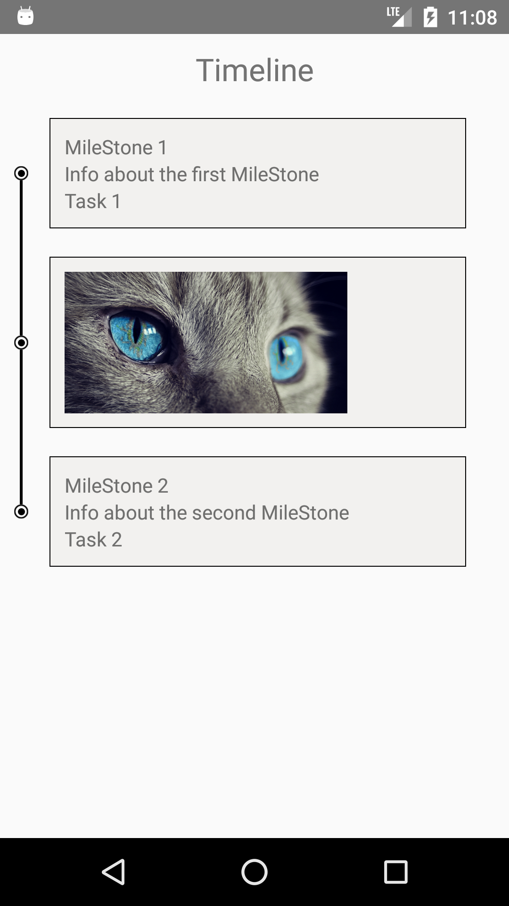

# Timeline

### App demo

*-This project contains a simple app that shows timeline/milestones for a work to be completed or get completed.-*

## Getting Started

### Clone the project
`git clone https://github.com/goyalanshu/Timeline.git`

#### Basic Usage

* Install npm modules in your project directory

      $ npm install
  
* For running the app: 

      $ react-native run-android
      
## Contribution

* <a href="https://github.com/GOYALANSHU">@ Anshu Goyal</a> The main Author
* <a href="">@ Girish Kumar Gupta</a> Contributor
* <a href="https://github.com/simerdeep">@ Simerdeep Singh</a> Contributor
